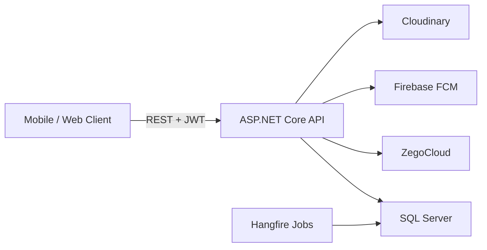

# Skillify API

**A production-grade backend for a peer-to-peer skill exchange platform** — where users teach what they know and learn what they need through scheduled, real-time video sessions powered by a credit-based economy.

Built with **ASP.NET Core 9**, **Entity Framework Core**, and a clean **Repository–Service–Controller** architecture. Designed as the backend for a mobile app (iOS & Android) under the **Digital Egypt Pioneers Initiative (DEPI)**.

[](https://dotnet.microsoft.com/)
[](https://dotnet.microsoft.com/apps/aspnet)
[](https://www.microsoft.com/sql-server)
[](https://swagger.io/)

---

## Table of Contents

- [What It Does](#what-it-does)
- [Why This Project Stands Out](#why-this-project-stands-out)
- [Features](#features)
- [Tech Stack](#tech-stack)
- [Architecture](#architecture)
- [Project Structure](#project-structure)
- [Getting Started](#getting-started)
- [Configuration](#configuration)
- [API Overview](#api-overview)
- [Background Jobs](#background-jobs)
- [Skills Demonstrated](#skills-demonstrated)
- [Documentation](#documentation)
- [License](#license)

---

## What It Does

Skillify connects people who want to **offer** a skill with people who **need** help in that area. The platform handles the full lifecycle:

1. **Users** register, build a profile (skills, languages, bio, photo), and receive a starting credit wallet.
2. **Sessions** are requested or offered between two users, scheduled at a future time, and paid for with credits held in escrow.
3. **Video meetings** run through **ZegoCloud** — the API issues secure room tokens when a session goes live.
4. **Credits** move automatically: held on booking, refunded on cancel/decline, released to the helper on completion.
5. **Ratings & reviews** are submitted after sessions and appear on user profiles.
6. **Notifications** (in-app + Firebase push) keep users informed about credit changes and platform events.

---

## Why This Project Stands Out

This is not a CRUD tutorial — it models **real business logic**:

| Capability | Implementation |
|------------|----------------|
| **Secure auth** | JWT access tokens + refresh token rotation, per-session logout, global revoke, `sid` claim binding |
| **Financial logic** | Escrow holds, immutable credit ledger, refund/release flows |
| **Real-time video** | ZegoCloud token generation with time-window and participant gates |
| **Async automation** | Hangfire jobs for session open/close and daily credit gifts |
| **Push notifications** | Firebase Cloud Messaging with device token management |
| **Input validation** | FluentValidation on all critical DTOs |
| **API protection** | Rate limiting (50 req/min), structured error responses |
| **Media uploads** | Cloudinary integration for profile pictures |
| **Database design** | 15+ entities, EF Core migrations, seeded catalog data |

---

## Features

### Authentication & Users
- Register / login with hashed passwords (ASP.NET Identity `PasswordHasher`)
- JWT access token (15 min) + refresh token (30 days) with rotation
- Logout (single device) and revoke (all devices)
- Profile completion with skill selection, languages, bio, and Cloudinary photo upload
- Paginated public user directory

### Sessions & Video
- Request help or offer help (two distinct credit flows)
- Accept, decline, cancel, reschedule with full state machine
- Automatic session lifecycle via Hangfire (`Pending → Accepted → Active → Completed`)
- ZegoCloud room creation and token endpoint with early-join window (2 min before start)

### Credits & Economy
- Starting balance of 100 credits for new users
- Escrow system — credits locked until session completes or is cancelled
- Full transaction history (`EscrowHold`, `EscrowRelease`, `Refund`, `GiftCredit`)
- Daily gift job for low-balance users (random 5–100 credits, once per 30 days)

### Ratings & Reviews
- Submit rating (1.0–5.0) with optional review text after session completion
- One rating per session; reviewer/reviewee derived from participants
- Public review listing per user; overall score on profile

### Notifications
- In-app notification inbox with unread count
- Mark single or all as read
- FCM device registration / unregistration
- Auto-notifications on credit events (earn, refund, gift)

### Catalog & Gamification
- Main skills, sub-skills, and languages (seeded on startup)
- Badge system with criteria types (`SessionCount`, `AverageRating`, `ConsistentHelping`)

---

## Tech Stack

| Category | Technologies |
|----------|-------------|
| **Framework** | ASP.NET Core 9 Web API |
| **Language** | C# 13 |
| **ORM** | Entity Framework Core 9 |
| **Database** | Microsoft SQL Server |
| **Auth** | JWT Bearer, refresh token rotation |
| **Validation** | FluentValidation 11 |
| **Background jobs** | Hangfire (SQL Server storage) |
| **API docs** | Swagger / Swashbuckle 6.6 (OpenAPI v1.3) |
| **Media** | Cloudinary |
| **Video** | ZegoCloud (real-time communication) |
| **Push** | Firebase Admin SDK (FCM) |
| **Testing libs** | Moq, FluentAssertions (project references) |

---

## Architecture

Layered architecture with dependency injection — each feature is a vertical slice:

```
HTTP Request
    │
    ▼
Controller  ──►  Service  ──►  Repository  ──►  AppDbContext  ──►  SQL Server
    │                │
    │                └──► FluentValidation, business rules, DTO mapping
    │
    └──► JWT auth, rate limiting, exception → HTTP status mapping
```



**Design patterns used:** Repository, Service Layer, DTO mapping, Validator pipeline, Background job scheduling, Escrow/ledger pattern.

---

## Project Structure

```
SkillifyAPI/
├── Controllers/          # API endpoints (9 controllers)
├── Services/             # Business logic
├── Repositories/         # Data access (EF Core)
├── Models/               # Domain entities
├── DTOs/                 # Request/response contracts
├── Validations/          # FluentValidation rules
├── Data/                 # AppDbContext
├── Migrations/           # EF Core migrations
├── Helper/               # Mappers, seeders, utilities
├── JwtService/           # Token generation & validation
├── CloudinaryService/    # Profile image uploads
├── ZegoService/          # Video room & token management
├── Firebase/             # Push notification service
├── BackgroundService/    # Hangfire job classes (DailyGift)
├── Program.cs            # DI, middleware, pipeline
└── QA_BusinessModel.md   # Full QA & testing guide
```

---

## Getting Started

### Prerequisites

| Tool | Version |
|------|---------|
| [.NET SDK](https://dotnet.microsoft.com/download) | 9.0+ |
| [SQL Server](https://www.microsoft.com/sql-server) | 2019+ (LocalDB, Express, or full) |
| [Git](https://git-scm.com/) | Any recent version |

**Optional (for full feature set):**
- [Cloudinary](https://cloudinary.com/) account — profile picture uploads
- [ZegoCloud](https://www.zegocloud.com/) account — video sessions
- [Firebase](https://firebase.google.com/) project — push notifications

### 1. Clone the repository

```bash
git clone https://github.com/YOUR_USERNAME/SkillifyAPI.git
cd SkillifyAPI
```

### 2. Configure settings

Copy and edit `appsettings.json`, or use **User Secrets** (recommended for local dev):

```bash
dotnet user-secrets init
dotnet user-secrets set "ConnectionStrings:DefaultConnection" "Server=.;Database=SkillifyAPI;Trusted_Connection=True;TrustServerCertificate=True;"
dotnet user-secrets set "Jwt:Key" "YourSuperSecretKeyThatIsAtLeast32CharactersLong!"
dotnet user-secrets set "Jwt:Issuer" "SkillifyAPI"
dotnet user-secrets set "Jwt:Audience" "SkillifyAPI"
```

See [Configuration](#configuration) for all required keys.

### 3. Restore & run

```bash
dotnet restore
dotnet run
```

The API starts at:
- **HTTP:** `http://localhost:5113`
- **HTTPS:** `https://localhost:7080`
- **Swagger UI:** `http://localhost:5113/swagger`

> On first run, EF Core applies pending migrations and seeds skills, languages, and badges automatically.

### 4. Explore the API

1. Open Swagger at `/swagger`
2. Register a user via `POST /api/Users/register`
3. Copy the `accessToken` from the response
4. Click **Authorize** in Swagger and enter: `Bearer {your_token}`
5. Try endpoints like `GET /api/Users/me` or `POST /api/Sessions/request`

### EF Core migrations (manual)

```bash
# Add a new migration
dotnet ef migrations add MigrationName

# Apply migrations
dotnet ef database update
```

---

## Configuration

All settings live in `appsettings.json` (override with User Secrets or environment variables in production).

| Section | Keys | Purpose |
|---------|------|---------|
| `ConnectionStrings:DefaultConnection` | SQL Server connection string | Database + Hangfire storage |
| `Jwt` | `Key`, `Issuer`, `Audience`, `AccessTokenExpirationMinutes`, `RememberMeRefreshTokenExpirationDays` | Authentication |
| `Cloudinary` | `CloudName`, `ApiKey`, `ApiSecret`, `CloudFolder` | Profile picture uploads |
| `Zego` | `AppId`, `ServerSecret` | Video room tokens |
| Firebase | Service account JSON in `Firebase/` folder | Push notifications (FCM) |

**Example `appsettings.json` skeleton** (replace with your values):

```json
{
  "ConnectionStrings": {
    "DefaultConnection": "Server=.;Database=SkillifyAPI;Trusted_Connection=True;TrustServerCertificate=True;"
  },
  "Jwt": {
    "Key": "<min-32-char-secret>",
    "Issuer": "SkillifyAPI",
    "Audience": "SkillifyAPI",
    "AccessTokenExpirationMinutes": "15",
    "RememberMeRefreshTokenExpirationDays": "30"
  },
  "Cloudinary": {
    "CloudName": "<your-cloud-name>",
    "ApiKey": "<your-api-key>",
    "ApiSecret": "<your-api-secret>",
    "CloudFolder": "SkillifyUserProfiles"
  },
  "Zego": {
    "AppId": "<your-app-id>",
    "ServerSecret": "<your-server-secret>"
  }
}
```

> **Security note:** Never commit real secrets to source control. Use User Secrets locally and environment variables or a vault in production.

---

## API Overview

**Swagger v1.3** documents all endpoints interactively at `/swagger`.

| Controller | Base Route | Description |
|------------|-----------|-------------|
| `UsersController` | `/api/Users` | Auth, profile, user listing |
| `SessionsController` | `/api/Sessions` | Session lifecycle + Zego token |
| `RatingsController` | `/api/Ratings` | Submit and browse reviews |
| `NotificationsController` | `/api/Notifications` | In-app notifications + FCM devices |
| `CreditTransactionsController` | `/api/CreditTransactions` | Credit ledger history |
| `MainSkillsController` | `/api/MainSkills` | Skill catalog |
| `SubSkillsController` | `/api/SubSkills` | Sub-skill catalog |
| `LanguagesController` | `/api/Languages` | Language catalog |
| `BadgesController` | `/api/Badges` | Badge catalog |

### Quick auth flow

```
POST /api/Users/register   →  { accessToken, refreshToken }
POST /api/Users/login      →  { accessToken, refreshToken }
POST /api/Users/refresh    →  new token pair (old refresh token revoked)
POST /api/Users/logout     →  revoke current session
POST /api/Users/revoke     →  revoke all sessions
```

Protected routes require header: `Authorization: Bearer <accessToken>`

---

## Background Jobs

Powered by **Hangfire** with SQL Server storage. Dashboard available at `/hangfire`.

| Job | Schedule | Purpose |
|-----|----------|---------|
| `OpenSession` | At session `ScheduledAt` | Transition `Accepted → Active`, schedule close |
| `CloseSession` | At session end time | Transition `Active → Completed`, release escrow, close Zego room |
| `DailyGift` | Daily at 03:00 UTC | Gift 5–100 credits to users with balance < 15 (once per 30 days) |

---

## Skills Demonstrated

This project showcases backend engineering skills relevant to **mid-level .NET developer** roles:

- **API design** — RESTful endpoints, consistent error contracts, Swagger documentation
- **Security** — JWT auth, refresh rotation, session revocation, rate limiting
- **Database modeling** — relational schema, FK constraints, unique indexes, migrations
- **Business logic** — state machines, escrow/ledger patterns, validation pipelines
- **Integrations** — third-party SDKs (Cloudinary, Zego, Firebase)
- **Async processing** — scheduled background jobs with Hangfire
- **Clean code** — separation of concerns, DI, interface-based abstractions
- **DevOps awareness** — configuration management, migration-on-startup, CORS, HTTPS

---

## Documentation

| Document | Description |
|----------|-------------|
| [`QA_BusinessModel.md`](./QA_BusinessModel.md) | Comprehensive QA guide — validation rules, all endpoints, state machines, test cases, error catalogue |
| **Swagger UI** | Live interactive API docs at `/swagger` when running locally |

---

## License

This project is licensed under the [MIT License](./LICENSE).

---

**Built by Ahmed Mohamed** · Digital Egypt Pioneers Initiative (DEPI)
