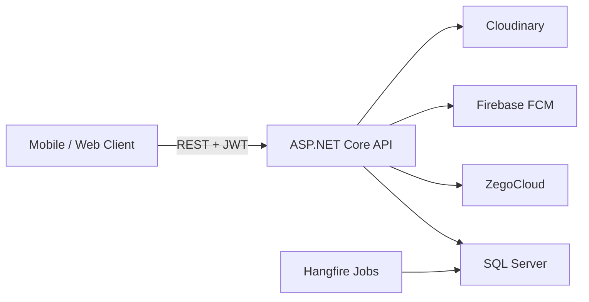

# Skillify API

**A production-grade backend for a peer-to-peer skill exchange platform** — where users teach what they know and learn what they need through scheduled, real-time video sessions powered by a credit-based economy.

Built with **ASP.NET Core 10**, **Entity Framework Core 10**, and a clean **Repository–Service–Controller** architecture. Designed as the backend for a mobile app (iOS & Android) under the **Digital Egypt Pioneers Initiative (DEPI)**.

[](https://skillifyapi-test.tryasp.net/swagger/index.html)
[](https://skillifyapi-test.tryasp.net/web_uikits.html)
[](https://skillifyapi-test.tryasp.net/hangfire)
[](https://dotnet.microsoft.com/)
[](https://dotnet.microsoft.com/apps/aspnet)
[](https://www.microsoft.com/sql-server)

> 🚀 **Live Interactive Test Environment:**  
> - 📄 **Swagger UI (Interactive API Docs):** [https://skillifyapi-test.tryasp.net/swagger/index.html](https://skillifyapi-test.tryasp.net/swagger/index.html)  
> - 📹 **Zego Video Web UI Kit (Live Meeting Test):** [https://skillifyapi-test.tryasp.net/web_uikits.html](https://skillifyapi-test.tryasp.net/web_uikits.html)  
> - ⚙️ **Hangfire Dashboard (Timed Jobs & Automation):** [https://skillifyapi-test.tryasp.net/hangfire](https://skillifyapi-test.tryasp.net/hangfire)  
>  
> ⚠️ **Note on Live Video Sessions (ZegoCloud):**  
> Due to the ZegoCloud free trial tier, real-time video session testing is active for **25 days**. After this period, video calls will require updated API keys. If you need to test the ZegoCloud integration after expiration, please contact me to refresh the test keys, or insert your own `AppId` and `ServerSecret` into `appsettings.json` and run the project locally.

---

## Table of Contents

- [What It Does](#what-it-does)
- [Why This Project Stands Out](#why-this-project-stands-out)
- [Features](#features)
- [Tech Stack](#tech-stack)
- [Architecture](#architecture)
- [Project Structure](#project-structure)
- [Getting Started](#getting-started)
- [Configuration](#configuration)
- [API Overview](#api-overview)
- [Background Jobs](#background-jobs)
- [Skills Demonstrated](#skills-demonstrated)
- [Documentation](#documentation)
- [License](#license)

---

## What It Does

Skillify connects people who want to **offer** a skill with people who **need** help in that area. The platform handles the full lifecycle:

1. **Users** register, build a profile (skills, languages, bio, photo), and receive a starting credit wallet.
2. **Sessions** are requested or offered between two users, scheduled at a future time with turn-based negotiation, and paid for with credits held in escrow.
3. **Video meetings** run through **ZegoCloud** — the API issues secure room tokens when a session goes live.
4. **Attendance & Credits** are automated via **Zego Webhooks**: escrow releases immediately when the Helper joins before the 50% mark, or refunds if the Helper fails to attend.
5. **Ratings & reviews** can be submitted by both participants after session completion.
6. **Notifications** (in-app + Firebase push) keep users informed about credit changes, session events, and rescheduling.

---

## Why This Project Stands Out

This is not a CRUD tutorial — it models **real business logic**:

| Capability | Implementation |
|------------|----------------|
| **Secure auth** | JWT access tokens + refresh token rotation, per-session logout, global revoke, `sid` claim binding |
| **Financial logic** | Escrow holds, immutable credit ledger, automatic refund/release flows |
| **Real-time video & webhooks** | ZegoCloud token generation + real-time attendance webhooks (`POST /api/zego/webhook`) |
| **Turn-based rescheduling** | Participant state tracking (`PendingRescheduleByUserId`) preventing back-to-back proposals |
| **Dual-user rating** | Both participants (requester & helper) can submit ratings per completed session |
| **Async automation** | Hangfire jobs for session open/close and daily credit gifts |
| **Push notifications** | Firebase Cloud Messaging with device token management |
| **Input validation** | FluentValidation on all critical DTOs + SessionValidator guard pattern |
| **API protection** | Rate limiting (50 req/min), structured error responses |
| **Media uploads** | Cloudinary integration for profile pictures (`PUT /api/Users/me/profile-picture`) |
| **Database design** | 15+ entities, EF Core migrations, SQL Server 2025, seeded catalog data |

---

## Features

### Authentication & Users
- Register / login with hashed passwords (ASP.NET Identity `PasswordHasher`)
- JWT access token (15 min) + refresh token (30 days) with rotation & per-session logout (`sid` claim)
- Logout (single device) and global revoke (all devices)
- Profile completion with multiple needed skills, languages, bio, and dedicated profile picture endpoint (`PUT /api/Users/me/profile-picture` via Cloudinary)
- Paginated and filtered user directory (`GET /api/Users` with name, main skill, minimum rating, spoken language filters; automatically excludes the authenticated caller)

### Sessions & Video
- Request help or offer help (two distinct credit & escrow flows)
- Turn-based rescheduling negotiation tracked via `PendingRescheduleByUserId`
- Accept, decline, cancel, reschedule with complete state machine (`Pending`, `Accepted`, `Active`, `ReOffered`, `Completed`, `Declined`, `Cancelled`, `Expired`)
- ZegoCloud room creation & secure room token generation with early-join window (-2 min before start)
- **Zego Webhook Attendance Automation (`POST /api/zego/webhook`)**: Real-time join detection releases escrow to Helper if joined before 50% mark; automatically expires and refunds session if Helper fails to join

### Credits & Economy
- Starting balance of 100 credits for new users
- Escrow system — credits locked until session completes or is cancelled/expired
- Full transaction ledger history (`EscrowHold`, `EscrowRelease`, `CreditEarned`, `Refund`, `GiftCredit`) returning transaction history and current credit balance
- Daily gift job for low-balance users (random 5–100 credits, once per 30 days)

### Ratings & Reviews
- Dual-user rating support — **both** participants (Requester and Helper) can independently rate a completed session once each
- Decimal scores (1.0–5.0) with optional review text
- Public review listing per user; overall average score displayed on user profiles

### Notifications
- In-app notification inbox with unread count
- Mark single or all notifications as read
- FCM device registration / unregistration for mobile push delivery
- Automatic notifications generated on credit movements (earn, release, refund, gift)

### Catalog & Gamification
- Main skills, sub-skills, and languages (seeded on startup)
- Badge system with criteria types (`SessionCount`, `AverageRating`, `ConsistentHelping`)

---

## Tech Stack

| Category | Technologies |
|----------|-------------|
| **Framework** | ASP.NET Core 10 Web API (`net10.0`) |
| **Language** | C# 13 |
| **ORM** | Entity Framework Core 10 |
| **Database** | Microsoft SQL Server 2025 |
| **Auth** | JWT Bearer, refresh token rotation (`sid` claim binding) |
| **Validation** | FluentValidation 11 + SessionValidator |
| **Background jobs** | Hangfire (SQL Server storage) |
| **API docs** | Swagger / Swashbuckle v10 (OpenAPI v2) |
| **Media** | Cloudinary SDK |
| **Video & Webhooks** | ZegoCloud RTC + Zego Server Webhook Callback |
| **Push** | Firebase Admin SDK (FCM) |
| **Testing libs** | Moq, FluentAssertions (project references) |

---

## Architecture

Layered architecture with dependency injection — each feature is a vertical slice:

```
HTTP Request
    │
    ▼
Controller  ──►  Service  ──►  Repository  ──►  AppDbContext  ──►  SQL Server
    │                │
    │                └──► FluentValidation, business rules, DTO mapping
    │
    └──► JWT auth, rate limiting, exception → HTTP status mapping
```


```mermaid
flowchart LR
    Client["Mobile / Web Client"]
    API["ASP.NET Core API"]
    SQL["SQL Server"]
    HF["Hangfire Jobs"]
    Zego["ZegoCloud"]
    FCM["Firebase FCM"]
    CDN["Cloudinary"]

    Client -->|REST + JWT| API
    API --> SQL
    HF --> SQL
    API --> Zego
    API --> FCM
    API --> CDN
```

**Design patterns used:** Repository, Service Layer, DTO mapping, Validator pipeline, Background job scheduling, Escrow/ledger pattern.

---

## Project Structure

```
SkillifyAPI/
├── Controllers/          # API endpoints (10 controllers including ZegoWebhookController)
├── Services/             # Business logic (SessionMeetingService, UserService, etc.)
├── Repositories/         # Data access (EF Core)
├── Models/               # Domain entities (Session, EscrowHold, Rating, etc.)
├── DTOs/                 # Request/response contracts
├── Validations/          # FluentValidation rules & SessionValidator
├── Data/                 # AppDbContext (SQL Server 2025 configuration)
├── Migrations/           # EF Core migrations
├── Helper/               # Mappers, seeders, utilities
├── JwtService/           # Token generation, session binding & validation
├── CloudinaryService/    # Profile image uploads
├── ZegoService/          # Video room & token management
├── Firebase/             # Push notification service (FCM)
├── BackgroundService/    # Hangfire job classes (DailyGift, OpenSession, CloseSession)
├── Program.cs            # DI, middleware, pipeline (.NET 10)
└── QA_BusinessModel.md   # Full QA & testing guide (v1.6)
```

---

## Getting Started

### Live Test Server
You can test and explore the live API, video rooms, and job queues directly without running locally:
- 📄 **Swagger UI (Interactive API Docs):** [https://skillifyapi-test.tryasp.net/swagger/index.html](https://skillifyapi-test.tryasp.net/swagger/index.html)
- 📹 **Zego Video Web UI Kit (Live Meeting Test):** [https://skillifyapi-test.tryasp.net/web_uikits.html](https://skillifyapi-test.tryasp.net/web_uikits.html)
- ⚙️ **Hangfire Dashboard (Jobs & Automation):** [https://skillifyapi-test.tryasp.net/hangfire](https://skillifyapi-test.tryasp.net/hangfire)

> 💡 **ZegoCloud Trial Limit:** Live video room testing via the hosted server is available for **25 days** under the free tier. To test live video meetings after expiration, reach out to update the ZegoCloud keys or supply your own `Zego:AppId` and `Zego:ServerSecret` in local `appsettings.json`.

### Prerequisites (For Local Setup)

| Tool | Version |
|------|---------|
| [.NET SDK](https://dotnet.microsoft.com/download) | 10.0+ |
| [SQL Server](https://www.microsoft.com/sql-server) | 2025 (or 2019+ LocalDB, Express, or full) |
| [Git](https://git-scm.com/) | Any recent version |

**Optional (for full feature set):**
- [Cloudinary](https://cloudinary.com/) account — profile picture uploads
- [ZegoCloud](https://www.zegocloud.com/) account — video sessions & webhooks
- [Firebase](https://firebase.google.com/) project — push notifications

### 1. Clone the repository

```bash
git clone https://github.com/YOUR_USERNAME/SkillifyAPI.git
cd SkillifyAPI
```

### 2. Configure settings

Copy and edit `appsettings.json`, or use **User Secrets** (recommended for local dev):

```bash
dotnet user-secrets init
dotnet user-secrets set "ConnectionStrings:DefaultConnection" "Server=.;Database=SkillifyAPI;Trusted_Connection=True;TrustServerCertificate=True;"
dotnet user-secrets set "Jwt:Key" "YourSuperSecretKeyThatIsAtLeast32CharactersLong!"
dotnet user-secrets set "Jwt:Issuer" "SkillifyAPI"
dotnet user-secrets set "Jwt:Audience" "SkillifyAPI"
```

See [Configuration](#configuration) for all required keys.

### 3. Restore & run

```bash
dotnet restore
dotnet run
```

The API starts at:
- **HTTP:** `http://localhost:5113`
- **HTTPS:** `https://localhost:7080`
- **Swagger UI:** `http://localhost:5113/swagger` or [Live Test Swagger](https://skillifyapi-test.tryasp.net/swagger/index.html)

> On first run, EF Core applies pending migrations and seeds skills, languages, and badges automatically.

### 4. Explore the API

1. Open Swagger locally at `/swagger` or use the [Live Test Environment](https://skillifyapi-test.tryasp.net/swagger/index.html)
2. Register a user via `POST /api/Users/register`
3. Copy the `accessToken` from the response
4. Click **Authorize** in Swagger and enter: `Bearer {your_token}`
5. Try endpoints like `GET /api/Users/me` or `POST /api/Sessions/request`

### EF Core migrations (manual)

```bash
# Add a new migration
dotnet ef migrations add MigrationName

# Apply migrations
dotnet ef database update
```

---

## Configuration

All settings live in `appsettings.json` (override with User Secrets or environment variables in production).

| Section | Keys | Purpose |
|---------|------|---------|
| `ConnectionStrings:DefaultConnection` | SQL Server connection string | Database + Hangfire storage |
| `Jwt` | `Key`, `Issuer`, `Audience`, `AccessTokenExpirationMinutes`, `RememberMeRefreshTokenExpirationDays` | Authentication |
| `Cloudinary` | `CloudName`, `ApiKey`, `ApiSecret`, `CloudFolder` | Profile picture uploads |
| `Zego` | `AppId`, `ServerSecret` | Video room tokens |
| Firebase | Service account JSON in `Firebase/` folder | Push notifications (FCM) |

**Example `appsettings.json` skeleton** (replace with your values):

```json
{
  "ConnectionStrings": {
    "DefaultConnection": "Server=.;Database=SkillifyAPI;Trusted_Connection=True;TrustServerCertificate=True;"
  },
  "Jwt": {
    "Key": "<min-32-char-secret>",
    "Issuer": "SkillifyAPI",
    "Audience": "SkillifyAPI",
    "AccessTokenExpirationMinutes": "15",
    "RememberMeRefreshTokenExpirationDays": "30"
  },
  "Cloudinary": {
    "CloudName": "<your-cloud-name>",
    "ApiKey": "<your-api-key>",
    "ApiSecret": "<your-api-secret>",
    "CloudFolder": "SkillifyUserProfiles"
  },
  "Zego": {
    "AppId": "<your-app-id>",
    "ServerSecret": "<your-server-secret>"
  }
}
```

> **Security note:** Never commit real secrets to source control. Use User Secrets locally and environment variables or a vault in production.

---

## API Overview

Interactive OpenAPI documentation is available locally at `/swagger` and online at [https://skillifyapi-test.tryasp.net/swagger/index.html](https://skillifyapi-test.tryasp.net/swagger/index.html).

| Controller | Base Route | Auth | Description |
|------------|-----------|------|-------------|
| `UsersController` | `/api/Users` | Mixed | Auth (login/register/refresh), profile management, profile picture upload, filtered user directory (excludes self) |
| `SessionsController` | `/api/Sessions` | ✅ Bearer | Session lifecycle (request, offer, accept, decline, cancel, turn-based reschedule) + Zego token |
| `RatingsController` | `/api/Ratings` | Mixed | Submit & browse reviews (dual rating support for both participants) |
| `ZegoWebhookController` | `/api/zego/webhook` | ❌ Public | ZegoCloud real-time attendance webhook & escrow release trigger |
| `NotificationsController` | `/api/Notifications` | ✅ Bearer | In-app notifications + FCM device token management |
| `CreditTransactionsController` | `/api/CreditTransactions` | ✅ Bearer | Credit transaction ledger history and current balance |
| `MainSkillsController` | `/api/MainSkills` | ❌ Public | Main skill catalog |
| `SubSkillsController` | `/api/SubSkills` | ❌ Public | Sub-skill catalog |
| `LanguagesController` | `/api/Languages` | ❌ Public | Language catalog |
| `BadgesController` | `/api/Badges` | ❌ Public | Badge catalog |

### Quick auth flow

```
POST /api/Users/register   →  { accessToken, refreshToken }
POST /api/Users/login      →  { accessToken, refreshToken }
POST /api/Users/refresh    →  new token pair (old refresh token revoked)
POST /api/Users/logout     →  revoke current session
POST /api/Users/revoke     →  revoke all sessions
```

Protected routes require header: `Authorization: Bearer <accessToken>`

---

## Background Jobs

Powered by **Hangfire** with SQL Server storage.  
- ⚙️ **Live Dashboard:** [https://skillifyapi-test.tryasp.net/hangfire](https://skillifyapi-test.tryasp.net/hangfire) (Local: `/hangfire`)

| Job | Schedule | Purpose |
|-----|----------|---------|
| `OpenSession` | At session `ScheduledAt` | Transition `Accepted → Active`, schedule close |
| `CloseSession` | At session end time | Transition `Active → Completed`, release escrow, close Zego room (or refund if helper no-show) |
| `DailyGift` | Daily at 03:00 UTC | Gift 5–100 credits to users with balance < 15 (once per 30 days) |

---

## Skills Demonstrated

This project showcases backend engineering skills relevant to **mid-level .NET developer** roles:

- **API design** — RESTful endpoints, consistent error contracts, Swagger documentation
- **Security** — JWT auth, refresh rotation, session revocation, rate limiting
- **Database modeling** — relational schema, FK constraints, unique indexes, migrations
- **Business logic** — state machines, escrow/ledger patterns, validation pipelines
- **Integrations** — third-party SDKs (Cloudinary, Zego, Firebase)
- **Async processing** — scheduled background jobs with Hangfire
- **Clean code** — separation of concerns, DI, interface-based abstractions
- **DevOps awareness** — configuration management, migration-on-startup, CORS, HTTPS

---

## Documentation & Live Test Links

| Document / Tool | Link | Description |
|-----------------|------|-------------|
| **QA & Business Model** | [`QA_BusinessModel.md`](./QA_BusinessModel.md) | Comprehensive QA guide (v1.6) — validation rules, all 10 controllers, state machines, test cases, error catalogue |
| **Live Interactive Docs** | [Live Swagger UI](https://skillifyapi-test.tryasp.net/swagger/index.html) | Online interactive Swagger UI testing environment |
| **Live Video Session Testing** | [Zego Video Web UI Kit](https://skillifyapi-test.tryasp.net/web_uikits.html) | Real-time video room UI test client |
| **Live Background Jobs** | [Hangfire Dashboard](https://skillifyapi-test.tryasp.net/hangfire) | Live dashboard for scheduled & recurring jobs |
| **Local Interactive Docs** | `/swagger` | Local Swagger UI endpoint (when running application locally) |

---

## License

This repository is provided for portfolio and evaluation purposes only.

Recruiters and hiring managers are welcome to review the source code.

No permission is granted to copy, modify, redistribute, or use this code in
other projects without the author's prior written permission.

This project is licensed under the [View-Only License](./LICENSE).

---

